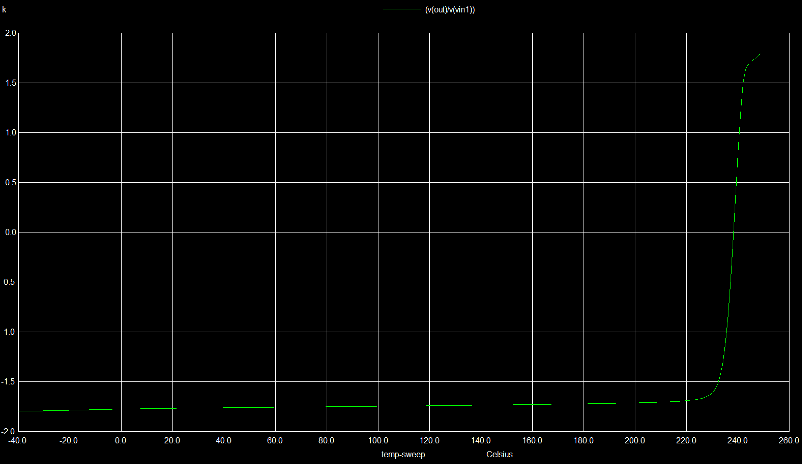

# Low Power Operational Amplifier in 130nm Technology

This project includes the simulation of two stage Operational Amplifier
design and postlayout simulation of different parameters of the Op-Amp.

# Contents
- [Overview of LV Op-Amp IP](#Overview-of-LV-Op-Amp-IP)
- [Block Diagram of Low Power Operational Amplifer IP](#Block-Diagram-of-Low-Power-Operational-Amplifer-IP)
- [Circuit Diagram of Low Power Operational Amplifer IP](#Circuit-Diagram-of-Low-Power-Operational-Amplifer-IP)
- [Specifications](#Specifications)
- [Performance Parameters](#Performance-Parameters)
- [Open Source Tools Used](#Open-Source-Tools-Used)
- [Installation in Ubuntu](#Installation-in-Ubuntu)
    - [eSim Installation](#eSim-Installation)
    - [Ngspice Installation](#Ngspice-Installation)
    - [SkyWater PDK Installation](#SkyWater-PDK-Installation)
- [Installation in Windows](#Installation-in-Windows)
    - [eSim Installation](#eSim-Installation)
- [Pre Layout Schematic and Simulations](#Pre-Layout-Schematic-and-Simulations)
- [Contributors](#Contributors)
- [Acknowledgmentsg](#Acknowledgments)
- [Contact Information](#Contact_Information)


## Overview of LV Op-Amp IP
The low power operational amplifier consists of two stages and operates at 1.8V power. It is designed to meet a set of provided specification such as high gain and low power consumption.

This two-stage op-amp is designed using the Skywater 130nm technology library. The proposed two stage op-amp consists of NMOS current mirror as bias circuit, differential amplifier as the first stage and common source amplifier as the second stage. 

The first stage of an op-amp contributed high gain while the second stage contributes a moderate gain. The results show that the circuit is able to work at 1.8V power supply voltage (VDD)


## Block Diagram of Low Power Operational Amplifer IP

 <p align="center">
 
 </p>


## Circuit Diagram of Low Power Operational Amplifer IP

 <p align="center">
  
 </p>


## Specifications

<table align="center">
<tr>
    <th>Specification</th>
    <th>Value</th>
</tr>
<tr>
    <td>Supply Voltage (VDD)</td>
    <td>1.8V</td>
</tr>
<tr>
    <td>Differential Gain</td>
    <td>72dB</td>
</tr>
<tr>
    <td>CMRR</td>
    <td>10dB</td>
</tr>
<tr>
    <td>Gain Bandwidth Product</td>
    <td>850MHz</td>
</tr>
<tr>
    <td>Phase Margin</td>
    <td>72&deg;</td>
</tr>
<tr>
    <td>Power Dissipation at <br/>
    10kHz 1mV p-p sinusoid <br/>
    with 1k&Omega;</td>
    <td>24 fW</td>
</tr>
<tr>
    <td>Slew Rate</td>
    <td>40 V/ns</td>
</tr>
</table>


## Performance Parameters

| Parameter | Description | Min | Type | Max | Unit | Condition |
| :---:  | :-: | :-: | :-: | :---:  | :-: | :-: |
| Technology | 0.18 um CMOS Process | | | | | |
| VDD | Supply Voltage | 0.6 (6.6db) | 1.8 (72db) | 19 (7.2db) | V | T= 27C |
| Differential Gain |  | 6.6 | 72 | 7.2 | db | T= 27C and for above Supply Volatges VDD |
| CMRR | Common Mode Rejection Ratio | 1790 | 1750 | 1690 | - | T=-40C to 200C |
| V-offset | Output Offset Voltage | -1.77 | -0.85 | -0.38 | V | T=-40C to 200C |


# Open-Source-Tools-Used

- eSim 
    - eSim (previously known as Oscad / FreeEDA) is a free/libre and open source EDA tool for circuit design, simulation, analysis and PCB design. It is an integrated tool built using free/libre and open source software such as KiCad, Ngspice and GHDL. eSim is released under GPL.
    - https://esim.fossee.in/home

- Ngspice
    - ngspice is the open source spice simulator for electric and electronic circuits.
    - http://ngspice.sourceforge.net/

- SkyWater Open Source PDK
    - The SkyWater Open Source PDK is a collaboration between Google and SkyWater Technology Foundry to provide a fully open source Process Design Kit and related resources, which can be used to create manufacturable designs at SkyWater’s facility.
    - https://github.com/google/skywater-pdk

- Magic
    - Magic is a venerable VLSI layout tool, written in the 1980's at Berkeley by John Ousterhout, now famous primarily for writing the scripting interpreter language Tcl. Due largely in part to its liberal Berkeley open-source license, magic has remained popular with universities and small companies. The open-source license has allowed VLSI engineers with a bent toward programming to implement clever ideas and help magic stay abreast of fabrication technology.
    - http://opencircuitdesign.com/magic/

# Installation in Ubuntu
- The eSim Software is currently available for Windows 7, 8 and 10 and Ubuntu 16.04 LTS and above

- The Magic Design Tool is available for Ubuntu
- Ngspice is installed when eSim is installed, but if any other version is needed please follow the steps mentioned

- The Pre-requisites for installing the following in Ubuntu are
    - git 
    - make

- Install them using

    To make sure that you install the latest version of the software(that is the package information is up to date)
    ```
    $ sudo apt-get update
    ```

    ```
    $ sudo apt install git

    $ sudo apt install make
    ```

## eSim Installation
Please refer to the following links for proper installation of *eSim*
- https://static.fossee.in/esim/installation-files/Install_eSim_on_Windows.pdf

- https://github.com/FOSSEE/eSim/blob/master/INSTALL

## Ngspice Installation
Please refer to the following links for proper installation of *Ngspice*
- http://ngspice.sourceforge.net/download.html

## SkyWater PDK Installation
- In Windows
    - Download the GitHub Repository : https://github.com/google/skywater-pdk

- In Ubuntu
In terminal, execute the following commands

- To download the repository into the current working directory
    ```
    $ git clone git://opencircuitdesign.com/open_pdks
    ```

- Go to `open_pks` directory
    ```
    $ cd open_pdks
    ```

- Configure and install
    ```
    $ ./configure --enable-sky130-pdk

    $ make

    $ sudo make install
    ```

# Installation in Windows
- The eSim Software is currently available for Windows 7, 8 and 10 and Ubuntu 16.04 LTS and above

- Ngspice and SkyWater PDK are installed when eSim is installed in Windows OS.

## eSim Installation
Please refer to the following links for proper installation of *eSim*
- https://static.fossee.in/esim/installation-files/Install_eSim_on_Windows.pdf
- https://static.fossee.in/esim/installation-files/eSim-2.3_installer.exe

Note: In windows there is no need to install ngspice and sky130nm PDK saperately. They will be installed when you install eSim directely.

## Pre Layout Schematic and Simulations

Create the schematic of your circuit withh mos transistors and extract the netlist file and by using kicad to ngspice converter in eSim convert the spice file into ngspice file and follow the below steps.

- Step1. Please download sky130 from this link and unzip : https://static.fossee.in/esim/installation-files/sky130_fd_pr.zip
- Step2. Save the .cir.out file in the sky_fd_pr folder as .cir file.
- Step3. Open with notepad and add the path .lib "models/sky130.lib.spice" tt  at the top.
- Step4. Replace with CMOSP, mos_p with sky130_fd_pr__pfet_01v8 and CMOSN, mos_n with  sky130_fd_pr__nfet_01v8.
- Step5. To replace an inductor, capacitor, or resistor do it this way for example: L1 out gnd 1m by x1  out gnd mid 0 sky130_fd_pr__ind_03_90.
- Note: For more details go to the cells folder in sky_fd_pr. Open the specific component folder which you want to use. Then open the test folder and check the SPICE file. The SPICE file is an example of implementation of
 that component. You will get to know how to use the component in your ckt.
- Step6. Now Run the ckt with ngspice

### To Run the ckt using ngspice:
- Step1. Right click on the .cir file.
- Step2. Click on Open With
- Step3. Browse for the ngspice.
- Step4. If ngspice is not present scroll down click on More Apps.
- Steps5. Go to the FOSSEE folder search for Ngspice. Run it.

## Differential Mode Gain
Run the following commands in ngspice run command window after setting the location of the .cir file.
```
source differential_mode_gain.cir
```


## Common Mode Gain
Run the following commands in ngspice run command window after setting the location of the .cir file.
```
source common_mode_gain.cir
```


## Offset Voltage
Run the following commands in ngspice run command window after setting the location of the .cir file.
```
source offset_voltage.cir
```


## Input Noise Spectrum
Run the following commands in ngspice run command window after setting the location of the .cir file.
```
source input_noise_spectrum
```	
To obtain Noise Spectrum 
- Please run the following commands in the ngspice window for obtaining the plot


- Use `setplot` to see all plots available

    ```
    ngspice-> setplot
    ```

- select the plot which has "Noise Spectral Density Curves".For example,
    ```
    ngspice-> setplot noise1
    ```
- Then plot the graph using the command
    ```
    ngspice-> plot inoise_spectrum
    ```


## Power Dissipation
```
source power_dissipation.cir
```


## Slew Rate
```
source slew_rate.cir
```


A much easier plot to see slew rate could be obtained by changing the analysis as
```
.tran 0.5f 10ns
```


## Transient Analysis
```
source transient_analysis.cir
```


## Temp V/S Differential Mode Gain (Temp : -40C - 200C)
```
source temp_differential_mode_gain.cir
```



## Temp V/S Common Mode Gain (Temp : -40C - 200C)
```
source temp_common_mode_gain.cir
```


## Temp V/S Offset Voltage (Temp : -40C - 200C)
```
source temp_offset_voltage.cir
```


<blockquote>
Note: 
<ul>
    <li>For performing any of the simulation mentioned in this repository the <b>sky130_fd_pr</b> folder is necessary.
    <li>All simulation given in this repository are properly linked to the <b>sky130_fd_pr</b> library. Hence files execute with no error if the <i> folders are kept as such</i>
    <li>For any external simulation using SkyWater Models, it is a must to properly include the library
</ul>
</blockquote>


## Contributors 

- **Velugoti Ashok kumar**

## Acknowledgments

- Kunal Ghosh, Director, VSD Corp. Pvt. Ltd.
- Sumanto kar, Assistant Project Manager, FOSSEE
- Dr.K.Babulu, Professor, Department of ECE, UCEV, JNTUK, DWARAPUDI Post, VIZIANAGARAM, A.P, 53500 

## Contact Information

- Velugoti Ashok kumar, Student, JNTU-GV CEV ashokkumarvelugoti@gmail.com
- Dr.K.Babulu, Professor, Department of ECE, UCEV, JNTUK kapbbl.ece@jntugvcev.edu.in
- Kunal Ghosh, Director, VSD Corp. Pvt. Ltd. kunalghosh@gmail.com
- Sumanto kar, Assistant Project Manager, FOSSEE
